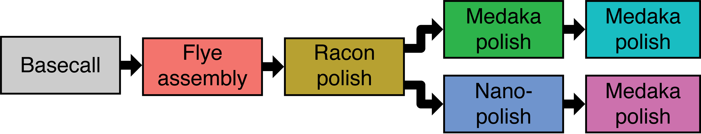
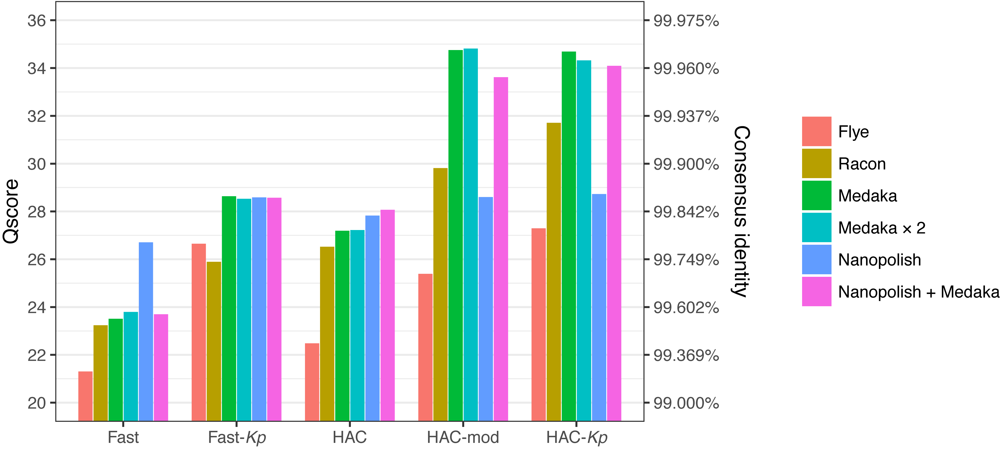

<p align="center"></p>


# August 2019 consensus accuracy update

__Ryan R. Wick<sup>1</sup>, Louise M. Judd<sup>1</sup> and Kathryn E. Holt<sup>1,2</sup>__
<br>
<sub>1. Department of Infectious Diseases, Central Clinical School, Monash University, Melbourne, Victoria 3004, Australia<br>2. London School of Hygiene & Tropical Medicine, London WC1E 7HT, UK</sub>

<p align="center"></p>

[](https://doi.org/10.5281/zenodo.1188469)


## Table of contents

* [Introduction](#introduction)
* [Methods](#methods)
  * [Genome and reads](#genome-and-reads)
  * [Pipeline](#pipeline)
  * [Basecalling](#basecalling)
  * [Assembly](#assembly)
  * [Racon](#racon)
  * [Medaka](#medaka)
  * [Nanopolish](#nanopolish)
  * [Additional rounds of Medaka](#additional-rounds-of-medaka)
* [Results](#results)
  * [Speed performance](#speed-performance)
  * [Assembly accuracy](#assembly-accuracy)
* [Conclusions](#conclusions)
* [License](#license)


## Introduction

This repository contains an addendum to our previous paper on Oxford Nanopore basecalling:<br>
[Wick RR, Judd LM, Holt KE. Performance of neural network basecalling tools for Oxford Nanopore sequencing. Genome Biology. 2019;20(1):129.](https://genomebiology.biomedcentral.com/articles/10.1186/s13059-019-1727-y)

It was motivated by two main questions. First, there have been some advancements with Guppy since our last paper, including additional basecalling models, and I was curious to see how well they performed. Second, I wanted to compare [Medaka](https://github.com/nanoporetech/medaka) and [Nanopolish](https://github.com/jts/nanopolish) as assembly polishers, a topic that we didn't explore much in our paper.

Unlike that previous paper, this isn't a comparison between different basecallers or a look at historical basecalling performance. Rather, it just examines the current version of Guppy using a few different basecalling models and some alternative polishing approaches.


## Methods

### Genome and reads

I chose to not use the same test read set we used in our previous study as it was from an R9.4 flowcell and getting a bit out-of-date. I instead chose a different _Klebsiella pneumoniae_ isolate that we recently sequenced as part of a barcoded run on an R9.4.1 flowcell.

This particular genome (named 67K) is not yet publicly available as it's part of a larger study that's in progress. It will be shared when that study is released. I chose this genome because it had a high yield of ONT reads and high-quality Illumina reads which enabled a clean hybrid assembly to use as a ground truth for sequence accuracy.

There were over 1 Gbp of total reads for this genome (an excessive amount) so I used [Filtlong](https://github.com/rrwick/Filtlong) to choose a high-quality subset of 100× depth (\~530 Mbp). This refined read set contained 14,979 reads with a nice N50 of \~38 kbp.


### Pipeline

Here is a high-level overview of what I did to the read set with each basecalling model:

<p align="center"></p>

Consensus accuracy was assessed at each applicable stage (the coloured boxes).


### Basecalling

I used Guppy v3.2.2 (the current version at the time of writing) with five different models (all of which use Guppy's flip-flop architecture):
* __Fast__: the 'r9.4.1_450bps_fast' basecalling model that comes with Guppy. This model has hidden layers of size 96 and a total of 285,160 parameters.
* __Fast-*Kp*__: this model has the same neural network architecture as the fast model but was trained on our _Klebsiella pneumoniae_-heavy dataset that we describe in [this paper](https://genomebiology.biomedcentral.com/articles/10.1186/s13059-019-1727-y). This greatly improved its ability to call _Kp_-specific base modifications.
* __HAC__: the 'r9.4.1_450bps_hac' basecalling model that comes with Guppy ('hac' meaning high-accuracy). It differs from the fast model in two ways: it takes a smaller stride with its convolutional layer (2 vs 4) and its hidden layers have a larger size (256 vs 96). It has a total of 1,989,160 parameters.
* __HAC-mod__: a new model recently added to Guppy which allows for calling 5mC and 6mA modified bases. It was trained on human and _E. coli_ reads (_E. coli_ being a close relative of our _Klebsiella pneumoniae_ test genome). While this basecalling model can produce a table containing per-base probabilities of modifications, we only used the standard FASTQ output with the four canonical bases.
* __HAC-*Kp*__: this model has the same neural network architecture as the HAC model but was trained on our _Klebsiella pneumoniae_-heavy dataset.

Here are the specific Guppy commands I used to basecall:
```
guppy_basecaller --input_path reads --save_path Fast --device auto --config dna_r9.4.1_450bps_fast.cfg --barcode_kits EXP-NBD114 --trim_barcodes
guppy_basecaller --input_path reads --save_path Fast-Kp --device auto --config dna_r9.4.1_450bps_fast.cfg --model holtlab_kp_fast_flipflop_r9.4_r9.4.1_apr_2019.jsn --barcode_kits EXP-NBD114 --trim_barcodes
guppy_basecaller --input_path reads --save_path HAC --device auto --config dna_r9.4.1_450bps_hac.cfg --barcode_kits EXP-NBD114 --trim_barcodes
guppy_basecaller --input_path reads --save_path HAC-mod --device auto --config dna_r9.4.1_450bps_modbases_dam-dcm-cpg_hac.cfg --barcode_kits EXP-NBD114 --trim_barcodes
guppy_basecaller --input_path reads --save_path HAC-Kp --device auto --config dna_r9.4.1_450bps_hac.cfg --model holtlab_kp_large_flipflop_r9.4_r9.4.1_apr_2019.jsn --barcode_kits EXP-NBD114 --trim_barcodes
```


### Assembly

For each basecalled read set, I assembled the reads with [Flye](https://github.com/fenderglass/Flye) v2.5 ([one of my favourite long-read assemblers](https://github.com/rrwick/Long-read-assembler-comparison)):
```
flye --nano-raw basecalled_reads.fastq --genome-size 5.5m --out-dir flye --threads 12
```

Each of the five basecalled sets assembled cleanly and completely with Flye, generating a circular chromosome (~5.3 Mbp) and a large circular plasmid (~160 kbp).


### Racon

I then polished each genome using [Racon](https://github.com/isovic/racon) v1.3.2. Specifically, I used [Rebaler](https://github.com/rrwick/Rebaler) v0.2.0 which does multiple rounds of Racon polishing:
```
rebaler --threads 8 flye/assembly.fasta basecalled_reads.fastq > rebaler.fasta
```


### Medaka

I then ran [Medaka](https://github.com/nanoporetech/medaka) v0.8.1 on the Racon-polished assembly:
```
medaka_consensus -i basecalled_reads.fastq -d rebaler.fasta -o medaka -t 12 -m r941_min_fast  # or -m r941_min_high, as appropriate
```

Medaka's models were trained on reads from particular basecalling models: `r941_min_fast` goes with the fast model and `r941_min_high` goes with the HAC model. This means that the other three models I ran (fast-_Kp_, HAC-mod and HAC-_Kp_) did not have a corresponding Medaka model. I therefore used what I thought would be the best match: `r941_min_fast` for the fast-_Kp_ model and `r941_min_high` for the HAC-mod and HAC-_Kp_ models.


### Nanopolish

I also ran [Nanopolish](https://github.com/jts/nanopolish) v0.11.1 on the Racon-polished assembly:
```
nanopolish index -d fast5s basecalled_reads.fastq
minimap2 -x map-ont -a -t 8 rebaler.fasta basecalled_reads.fastq | samtools sort > alignments.bam
samtools index alignments.bam
samtools faidx rebaler.fasta
python nanopolish_makerange.py rebaler.fasta | parallel -P 8 nanopolish variants --consensus -o polished."$range".vcf -w "$range" -r basecalled_reads.fastq -b alignments.bam -g rebaler.fasta -t 6 --min-candidate-frequency 0.1 --methylation-aware=dcm,dam --fix-homopolymers
nanopolish vcf2fasta -g rebaler.fasta polished.*.vcf > nanopolish.fasta
```

I used the `--methylation-aware=dcm,dam` and `--fix-homopolymers` options because in the past I found these to work well for _K. pneumoniae_ genomes.


### Additional rounds of Medaka

Finally, I tried running Medaka on both the Medaka and Nanopolish consensus assemblies. I used the same Medaka command shown above and called the results 'Medaka × 2' and 'Nanopolish + Medaka'.


## Results

### Speed performance

Basecalling was pretty quick on the GTX 1080 GPU of our [MinION desktop](https://github.com/rrwick/MinION-Desktop). The fast and fast-_Kp_ models completed basecalling in \~8.5 minutes (\~1,000,000 bases/sec). The HAC, HAC-mod and HAC-_Kp_ models each took \~50 minutes (\~180,000 bases/sec). We didn't try basecalling on the CPU but based on past experience it would be much slower than the GPU. The speed performance of Guppy is correlated with the number of parameters in its neural network model. The HAC models have \~7× more parameters than the fast models and are \~6× slower.

It's also worth noting that Medaka is much faster than Nanopolish. I didn't time them in a systematic manner, but Medaka ran on my laptop in a few minutes while Nanopolish took about an hour using many nodes of a computing cluster.


### Assembly accuracy

Here are the accuracy results, plotted using the log-based [Phred quality score](https://en.wikipedia.org/wiki/Phred_quality_score):

<p align="center"></p>

First of all, there were some unsurprising results: high-accuracy models did better than fast models, and models which included _Kp_-specific methylation in their training did better than those which did not. This much I expected based on my previous studies.

I also expected to see that Racon improved upon the Flye assembly, and this was indeed usually the case. The one exception was for the fast-_Kp_ model, where Flye did quite well and Racon actually made the assembly slightly worse – not sure what's going on there.

Medaka always improved the assembly and produced the highest accuracy results in the study with the HAC-mod and HAC-_Kp_ models. Running Medaka a second time did not make much of a difference – sometimes it made the assembly a tiny bit better, sometimes a tiny bit worse.

Nanopolish did better than Medaka for the fast model, similarly to Medaka for the fast-_Kp_ and HAC models, and worse than Medaka in the HAC-mod and HAC-_Kp_ models. For the HAC-mod and HAC-_Kp_ models, Nanopolish was actually worse than the Racon-polished assembly it took as input. Another way to look at this is that Nanopolish seemed to produce assemblies somewhere around Q28, and if the input assembly was already much higher than that, Nanopolish was likely to make things worse not better. Running Nanopolish before Medaka did not show any advantage over just running Medaka.


## Conclusions

To summarise our results as a set of recommendations:
1) Use high-accuracy models over fast models. This can be very slow on a CPU, so GPU basecalling is recommended.
2) If you're sequencing native DNA, use a model that was trained on reads with the same bases modifications as your sample, ideally from the same species.
3) Polishing with Medaka is fast, effective and usually preferable over Nanopolish. Don't bother with multiple rounds of Medaka polishing.

Medaka is trained on a per-model basis and the Medaka documentation states 'It is crucially important to specify the correct model'. The Holt lab mainly uses the HAC-_Kp_ to basecall, and the fact that there isn't a corresponding Medaka model has discouraged me from using it in the past. However, our results show that Medaka can work quite nicely even if you aren't using the exact same basecalling model it was trained on. This is encouraging and means I'll be using Medaka more in the future!

Our best assemblies were about 99.97% accurate, which equates to about one error per \~3000 bases (\~1600 errors in a 5 Mbp genome). Certainly an improvement over ONT results in the past but still too high of an error rate to replace Illumina sequencing in all contexts. Hopefully ONT's new R10 pore will deliver greater accuracies. The Holt lab will be trying them out in the near future!


## License

[GNU General Public License, version 3](https://www.gnu.org/licenses/gpl-3.0.html)
